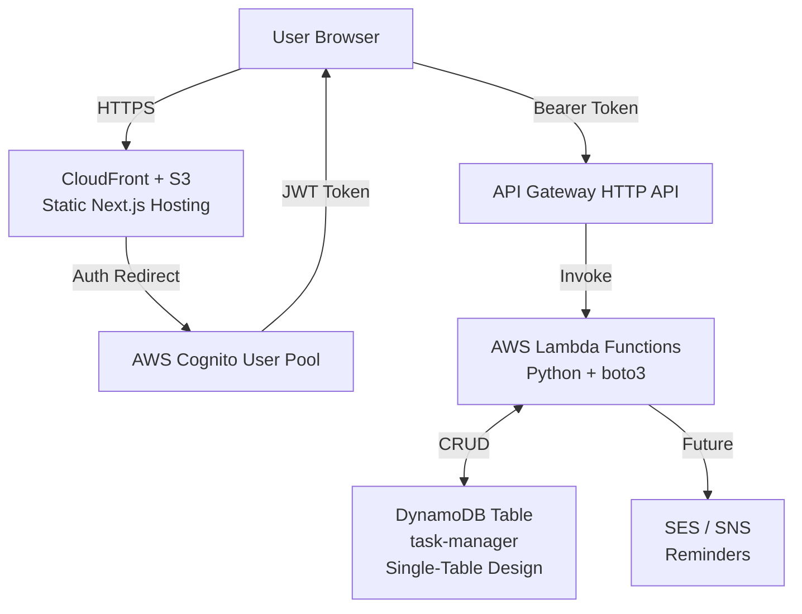

# TaskFlow - Serverless Task Manager

**TaskFlow** is a modern, fully serverless task management application designed for productivity without infrastructure overhead.  

Built with **Next.js 15+ (TypeScript)** on the frontend and a clean **Python + AWS Lambda** backend, it delivers a responsive UI, secure authentication, and scalable task storage.

---

## Architecture Diagram

---

## Features

- **Secure Authentication** – AWS Cognito User Pools with email/password sign-up & sign-in

- **Full CRUD Operations** – Create, read, update, delete tasks via RESTful API

- **Rich Task Metadata** – Title, description, due date, category, priority, starred status

- **Responsive & Modern UI** – Next.js App Router + Tailwind CSS (dark mode ready)

- **Fully Serverless** – Zero server management with AWS Lambda, API Gateway & DynamoDB

- **Infrastructure as Code** – AWS SAM (Serverless Application Model) for backend

- **Static Hosting** – Next.js static export → S3 + CloudFront CDN

- **Planned** – Email/SMS reminders (SES + EventBridge), file attachments (S3)

---

## Tech Stack

| Layer          | Technology                              | Purpose                              |
|----------------|-----------------------------------------|--------------------------------------|
| Frontend       | Next.js 15 (App Router) + TypeScript    | UI, routing, static export           |
| Styling        | Tailwind CSS + Heroicons                | Modern, responsive design            |
| Authentication | AWS Cognito                             | User management & JWT tokens         |
| Backend        | AWS Lambda (Python 3.12)                | Business logic                       |
| API            | AWS API Gateway (HTTP API)              | REST endpoints + CORS                |
| Database       | AWS DynamoDB                            | Scalable NoSQL storage               |
| IaC / Deploy   | AWS SAM CLI                             | Define & deploy serverless resources |
| Hosting        | Amazon S3 + CloudFront                  | Global CDN for static frontend       |

--- 

## AWS Services used

### AWS SAM

AWS Serverless Application Model (SAM) is used to define and deploy the serverless backend infrastructure. The `template.yaml` file contains the definitions for the Lambda functions, API Gateway, DynamoDB tables, and Cognito User Pool. 

### AWS Cognito

AWS Cognito is used for user authentication and management. It provides secure sign-up and sign-in functionality, as well as user profile management. 

### AWS Lambda

AWS Lambda functions are used to implement the backend logic for task management. Each function corresponds to a specific API endpoint defined in the API Gateway.

### AWS API Gateway

AWS API Gateway is used to create and manage the RESTful API for the task manager. It routes incoming requests to the appropriate Lambda functions.

### AWS DynamoDB

AWS DynamoDB is used as the primary data store for tasks. It provides a scalable and low-latency NoSQL database solution.

---

## Under Development

This project is currently under development. Features and architecture may change as the project evolves.
Contributions and feedback are welcome!

---